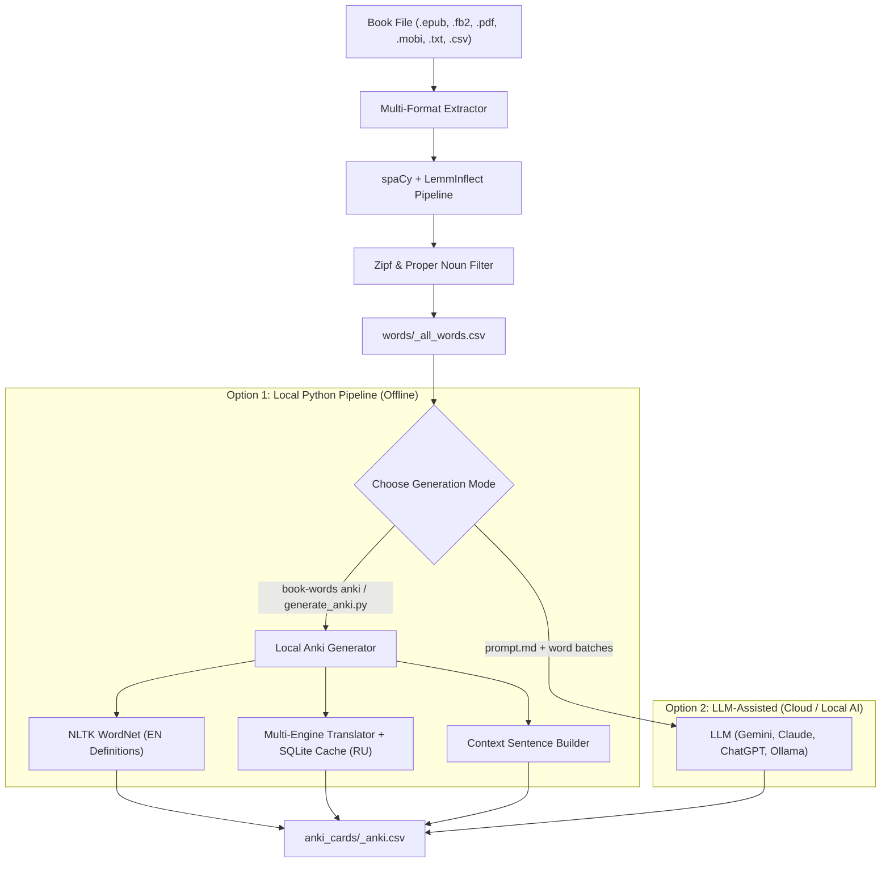

# BookWords 📚 ➔ 📇

[](https://www.python.org/downloads/)
[](https://opensource.org/licenses/MIT)
[](#generation-modes-choose-your-path)
[](#importing-into-anki)

Extract high-yield English vocabulary from any book or document and generate ready-to-import Anki flashcards with English definitions, Russian translations, and context sentences.

Supports two flexible workflows:
1. **100% Local Python Libraries (Offline, Zero API keys)** — Fast, private, free, and powered by WordNet, `spaCy`, and SQLite caching.
2. **LLM-Assisted Generation (Gemini, Claude, ChatGPT, Ollama)** — AI-crafted definitions and contextual story sentences guided by a pre-tuned system prompt (`prompt.md`).

---

## Features

- **Multi-Format Ingestion**: Works seamlessly with **`.epub`**, **`.fb2`**, **`.txt`**, **`.pdf`**, **`.mobi` / `.azw3`**, and **`.csv`**.
- **Accurate Lemmatization**: Powered by `spaCy` + `lemminflect` to correctly extract base dictionary forms without truncating irregular verbs.
- **Smart Vocabulary Filtering**:
  - Automatically filters out proper nouns (character names, fantasy races, locations).
  - Uses the **Zipf Frequency Scale** to remove basic everyday words (e.g. *walk, water, good*) so you only study unfamiliar words.
  - Excludes non-dictionary noise and sound effects (*pspspsps, thwump*).
- **High-Impact Prioritization**: Words are ranked by occurrence frequency in your book — the words that appear 50–100+ times appear at the top of your study deck!
- **Rich Anki Flashcards**: Each card includes:
  - Base lemma (`Front`)
  - English definition
  - Frequency importance rating (1–10 based on Zipf score)
  - Natural Russian translation
  - Morphological derivation / base form
  - Context example sentence
- **Two Generation Engines**: Choose between 100% local Python scripts or LLM-prompted generation depending on your needs.

---

## Architecture



---

## Installation

This project uses [`uv`](https://github.com/astral-sh/uv) for fast, reproducible dependency management:

```bash
# Clone the repository
git clone https://github.com/alibek-galiyev/ANKI-cards-generator.git
cd ANKI-cards-generator

# Install dependencies and spaCy model
uv sync
```

---

## Workflow Step-by-Step

### Step 1: Place Your Book
Drop any eBook or text document into the `books/` folder:
```
books/
├── Dungeon_Crawler_Carl.epub
├── Alice_in_Wonderland.fb2
└── Dracula.txt
```

### Step 2: Extract Vocabulary
Extract and rank the unfamiliar words from your book:
```bash
# Option A: Run via unified CLI
uv run book-words extract books/Dungeon_Crawler_Carl.epub

# Option B: Run via script (auto-detects book in books/)
uv run python main.py
```
*Output is automatically saved to `words/<book_name>_all_words.csv`.*

---

## Generation Modes: Choose Your Path

Once you have `words/<book_name>_all_words.csv`, choose how to generate your Anki cards:

| Feature | 🐍 Option 1: Local Python Libraries | 🤖 Option 2: LLM (Gemini, Claude, GPT) |
| :--- | :--- | :--- |
| **Internet Access** | **Zero needed** (100% offline with cached translations) | Required for cloud LLMs (unless using local Ollama) |
| **API Keys / Cost** | **Free**, zero API keys | May require API keys, credits, or web subscription |
| **Speed** | **Fast** (hundreds of words per minute) | Slower (rate limits, tokens per minute) |
| **English Definitions**| Princeton WordNet (precise, standard dictionary) | Generative (natural, context-adapted) |
| **Russian Translation**| Local multi-engine with persistent SQLite cache | Natural context-aware LLM translation |
| **Context Sentences**  | WordNet examples & dictionary sentences | Custom generated sentences or novel context |
| **Best For** | Large vocabulary decks (500–5,000+ words), privacy, offline work | Curated top-100 high-yield lists, nuanced literary phrasing |

---

### Option 1: 100% Local Python Libraries (Default)

Use standard Python NLP tools with no external AI calls:
- **NLTK Princeton WordNet**: Generates dictionary definitions and example sentences.
- **spaCy + LemmInflect**: Handles base forms and derivations.
- **Persistent SQLite Translation Cache** (`data/translations.sqlite`): Translates words to Russian once, then serves them instantly offline from disk.

#### How to Run:
```bash
# Via unified CLI
uv run book-words anki words/dungeon_crawler_carl_all_words.csv

# Or via script (auto-detects latest words CSV in words/)
uv run python generate_anki.py
```

*Output file:* `anki_cards/<book_name>_anki.csv`

---

### Option 2: LLM-Assisted Generation (Gemini / Claude / ChatGPT / Ollama)

If you prefer rich, AI-generated explanations and novel-specific context sentences, you can feed batches of words to an LLM using the included [`prompt.md`](prompt.md).

#### How to Run with an LLM:

1. **Open [`prompt.md`](prompt.md)** in your editor. It contains strict formatting instructions that guarantee Anki-compliant CSV output (proper HTML tags, semicolon delimiters, no internal semicolons).
2. **Copy the prompt** into your LLM of choice (Google Gemini, Anthropic Claude, OpenAI ChatGPT, or local Ollama).
3. **Provide a batch of words** from your extracted `words/<book_name>_all_words.csv` (e.g. rows 1–100 for the highest-frequency words):
   ```text
   Process the following words (1 to 50):
   dungeon
   crawler
   smite
   aberration
   ...
   ```
4. **Copy the LLM's response** and paste or append it into your card file:
   ```bash
   # Save or append cards
   cat << 'EOF' >> anki_cards/<book_name>_anki.csv
   dungeon;<b>Present form:</b> dungeon<br><b>Definition (EN):</b> an underground prison or fortress cell<br><b>Importance (1–10):</b> 6<br><b>Translation (RU):</b> подземелье<br><b>Formed from:</b> Base form<br><b>Simple sentence:</b> The hero escaped from the dark dungeon.
   EOF
   ```

> [!TIP]
> Processing words in batches of 50–100 ensures the LLM does not hallucinate, truncate responses, or exceed context output limits.

---

## Importing into Anki

1. Open **Anki**.
2. Click **File $\to$ Import...** (or press `Cmd+I` / `Ctrl+I`).
3. Select your generated file from `anki_cards/` (e.g. `anki_cards/dungeon_crawler_carl_anki.csv`).
4. Set the import options:
   * **Note Type:** `Basic`
   * **Deck:** Choose or create a deck (e.g. *Book Vocabulary*)
   * **Field separator:** Set to `Semicolon` (`;`)
   * **Allow HTML in fields:** **CHECKED** (required for `<b>` labels and `<br>` line breaks)
   * **Field mapping:**
     - Field 1 $\to$ `Front`
     - Field 2 $\to$ `Back`
5. Click **Import**.

### Sample Card Preview

```
[Front]
dungeon

[Back]
<b>Present form:</b> dungeon<br>
<b>Definition (EN):</b> the main tower within the walls of a medieval castle or fortress<br>
<b>Importance (1–10):</b> 5<br>
<b>Translation (RU):</b> подземелье<br>
<b>Formed from:</b> Base form<br>
<b>Simple sentence:</b> The prisoners were locked inside the dark dungeon.
```

---

## Configuration & Tuning

All settings can be customized via CLI flags or modified in `src/book_words/lemmatizer.py`:

| Parameter | Default | Description |
| :--- | :--- | :--- |
| `--zipf-max` | `4.0` | Words with Zipf $> 4.0$ are filtered out (excludes common everyday words). |
| `--zipf-min` | `0.5` | Words with Zipf $< 0.5$ are filtered out (excludes non-words and typos). |
| `--min-count` | `2` | Minimum times a word must appear in the novel to be included. |
| `--sort-by` | `book_count` | Sort order: `book_count` (highest-impact first) or `rarity` (rarest first). |

---

## Project Structure

```
ANKI-cards-generator/
├── src/
│   └── book_words/
│       ├── __init__.py
│       ├── extractors.py       # Multi-format parsers (.epub, .fb2, .txt, .pdf, .mobi, .csv)
│       ├── lemmatizer.py       # spaCy + LemmInflect NLP pipeline & Zipf scoring
│       ├── anki_generator.py   # 100% Local Anki card generator with SQLite cache
│       └── cli.py              # Unified CLI interface
├── main.py                     # Vocabulary extraction entrypoint script
├── generate_anki.py            # Local Anki generator entrypoint script
├── prompt.md                   # System prompt for LLM-assisted card generation
├── books/                      # Drop your book files here (.gitkeep)
├── words/                      # Extracted vocabulary CSV files (.gitkeep)
├── anki_cards/                 # Ready-to-import Anki CSV decks (.gitkeep)
├── data/                       # Local SQLite translation cache (.gitkeep)
├── pyproject.toml              # Modern package configuration & dependencies
├── .gitignore                  # Clean Git repository ignore rules
├── .gitattributes             # Line ending normalization
├── LICENSE                     # MIT License
└── README.md                   # Documentation
```

---

## License

This project is licensed under the [MIT License](LICENSE).
