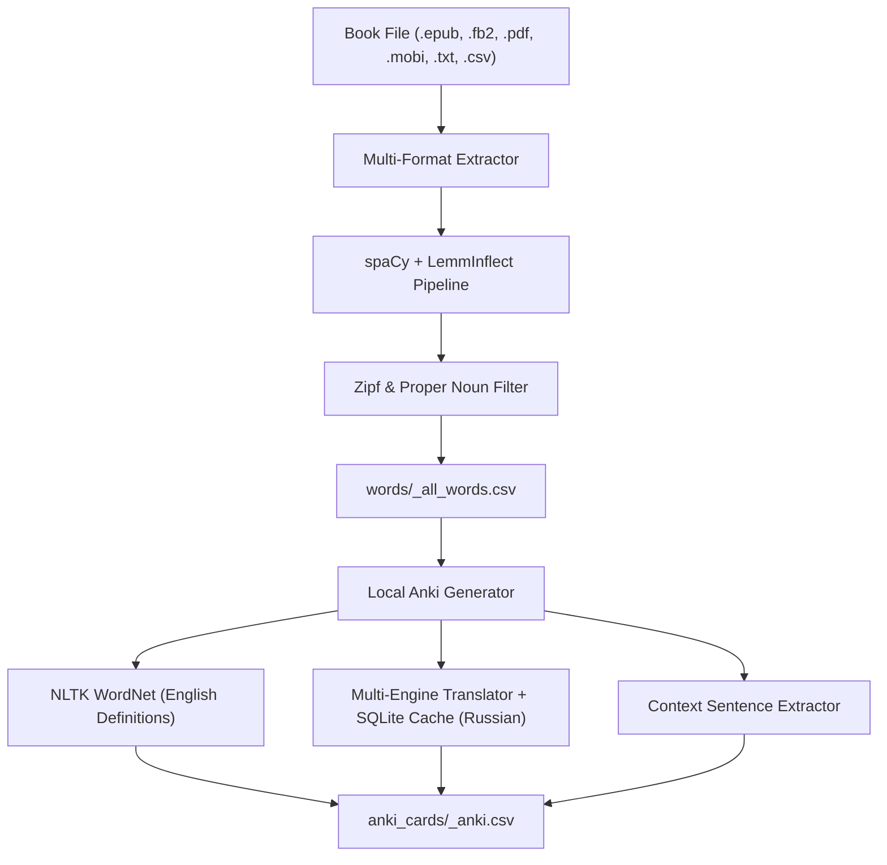

# BookWords 📚 ➔ 📇

[](https://www.python.org/downloads/)
[](https://opensource.org/licenses/MIT)
[-success.svg)](#features)
[](#importing-into-anki)

Extract high-yield English vocabulary from any book or document and generate ready-to-import Anki flashcards with English definitions, Russian translations, and context sentences — **100% locally with zero cloud API keys or external LLM requests**.

---

## Features

- **100% Local & Offline**: Uses Princeton WordNet, local linguistic pipelines, and persistent SQLite translation caching. No Gemini, OpenAI, or cloud API keys needed.
- **Multi-Format Support**: Works seamlessly with **`.epub`**, **`.fb2`**, **`.txt`**, **`.pdf`**, **`.mobi` / `.azw3`**, and **`.csv`**.
- **Accurate Lemmatization**: Powered by `spaCy` + `lemminflect` to correctly extract base dictionary forms without truncating irregular verbs.
- **Smart Vocabulary Filtering**:
  - Automatically filters out proper nouns (character names, fantasy races, locations).
  - Uses the **Zipf Frequency Scale** to remove basic everyday words (e.g. *walk, water, good*) so you only study unfamiliar words.
  - Excludes non-dictionary noise and sound effects (*pspspsps, thwump*).
- **High-Impact Prioritization**: Words are ranked by occurrence frequency in your book — the words that appear 50–100+ times appear at the top of your study deck!
- **Rich Anki Flashcards**: Each card includes:
  - Base lemma (`Front`)
  - English definition (`WordNet`)
  - Frequency importance rating (1–10 based on Zipf score)
  - Natural Russian translation
  - Morphological derivation / base form
  - Context sentence from the novel or dictionary

---

## Architecture



---

## Installation

This project uses [`uv`](https://github.com/astral-sh/uv) for fast, reproducible dependency management:

```bash
# Clone the repository
git clone https://github.com/your-username/book-words.git
cd book-words

# Install all dependencies and spaCy model
uv sync
```

---

## Quick Start Guide

### Step 1: Place Your Book
Drop any eBook or text document into the `books/` folder:
```
books/
├── Dungeon_Crawler_Carl.epub
├── Alice_in_Wonderland.fb2
└── Dracula.txt
```

### Step 2: Extract Vocabulary
Extract and rank the unfamiliar words from your book:
```bash
# Option A: Run via unified CLI
uv run book-words extract books/Dungeon_Crawler_Carl.epub

# Option B: Run via script
uv run python main.py books/Dungeon_Crawler_Carl.epub
```
*Output is automatically saved to `words/<book_name>_all_words.csv`.*

### Step 3: Generate Anki Flashcards
Generate the complete Anki-ready flashcard deck:
```bash
# Option A: Run via unified CLI
uv run book-words anki words/dungeon_crawler_carl_all_words.csv

# Option B: Run via script
uv run python generate_anki.py words/dungeon_crawler_carl_all_words.csv
```
*Output is saved to `anki_cards/<book_name>_anki.csv`.*

---

## Importing into Anki

1. Open **Anki**.
2. Click **File $\to$ Import...** (or press `Cmd+I` / `Ctrl+I`).
3. Select your generated file from `anki_cards/` (e.g. `anki_cards/dungeon_crawler_carl_anki.csv`).
4. Set the import options:
   * **Note Type:** `Basic`
   * **Deck:** Choose or create a deck (e.g. *Book Vocabulary*)
   * **Field separator:** Set to `Semicolon` (`;`)
   * **Allow HTML in fields:** **CHECKED** (required for `<b>` labels and `<br>` line breaks)
   * **Field mapping:**
     - Field 1 $\to$ `Front`
     - Field 2 $\to$ `Back`
5. Click **Import**.

### Sample Card Preview

```
[Front]
dungeon

[Back]
<b>Present form:</b> dungeon<br>
<b>Definition (EN):</b> the main tower within the walls of a medieval castle or fortress<br>
<b>Importance (1–10):</b> 5<br>
<b>Translation (RU):</b> подземелье<br>
<b>Formed from:</b> Base form<br>
<b>Simple sentence:</b> The prisoners were locked inside the dark dungeon.
```

---

## Configuration & Tuning

All settings can be customized via CLI flags or modified in `src/book_words/lemmatizer.py`:

| Parameter | Default | Description |
| :--- | :--- | :--- |
| `--zipf-max` | `4.0` | Words with Zipf $> 4.0$ are filtered out (excludes common everyday words). |
| `--zipf-min` | `0.5` | Words with Zipf $< 0.5$ are filtered out (excludes non-words and typos). |
| `--min-count` | `2` | Minimum times a word must appear in the novel to be included. |
| `--sort-by` | `book_count` | Sort order: `book_count` (highest-impact first) or `rarity` (rarest first). |

---

## Project Structure

```
book-words/
├── src/
│   └── book_words/
│       ├── __init__.py
│       ├── extractors.py       # Multi-format parsers (.epub, .fb2, .txt, .pdf, .mobi, .csv)
│       ├── lemmatizer.py       # spaCy + LemmInflect NLP pipeline & Zipf scoring
│       ├── anki_generator.py   # 100% Local Anki card generator with SQLite cache
│       └── cli.py              # Unified CLI interface
├── main.py                     # Vocabulary extraction entrypoint script
├── generate_anki.py            # Local Anki generator entrypoint script
├── books/                      # Drop your book files here (.gitkeep)
├── words/                      # Extracted vocabulary CSV files (.gitkeep)
├── anki_cards/                 # Ready-to-import Anki CSV decks (.gitkeep)
├── data/                       # Local SQLite translation cache (.gitkeep)
├── pyproject.toml              # Modern package configuration & dependencies
├── .gitignore                  # Clean Git repository ignore rules
├── .gitattributes             # Line ending normalization
├── LICENSE                     # MIT License
└── README.md                   # Documentation
```

---

## License

This project is licensed under the [MIT License](LICENSE).
